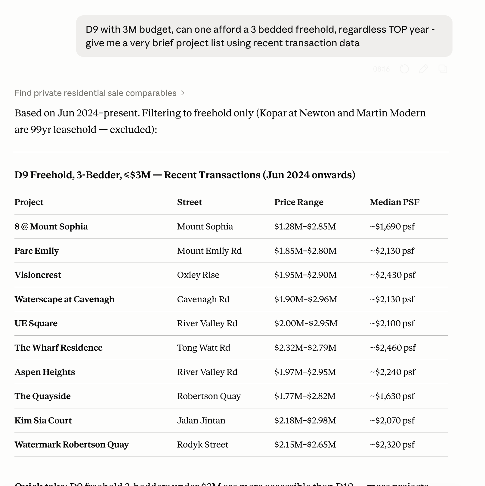
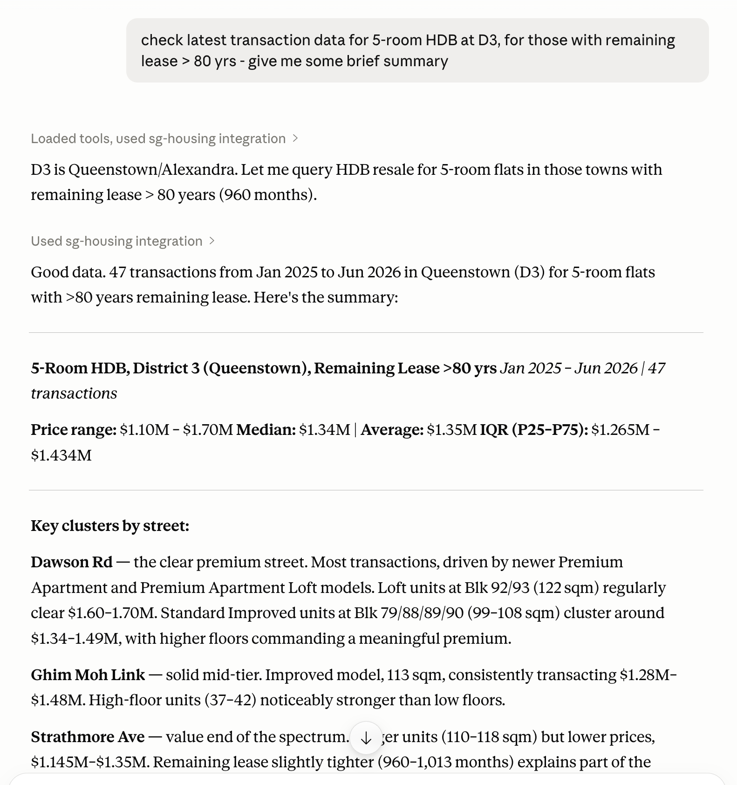
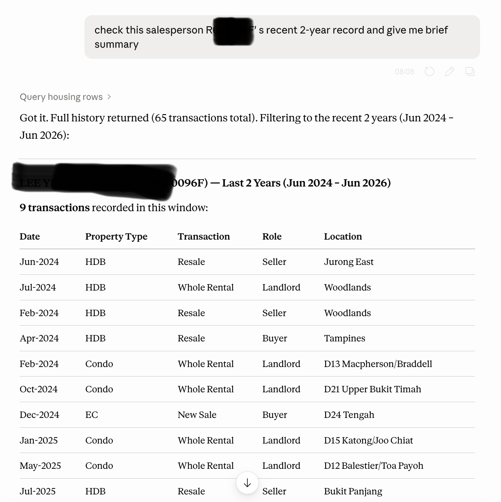

# sg-housing-data

Singapore housing/property data tools for AI agents.

This package provides a local MCP server for Claude Desktop, Claude Code, Codex CLI, and other MCP clients. It exposes curated HDB, CEA, data.gov.sg, and URA private residential data through bounded, agent-friendly tools.

Detailed URA private residential tools and data.gov.sg queries work out of the box through maintained Vercel proxies. End users do not configure API keys, and the npm package does not embed URA or data.gov.sg credentials.

## Install

Install the latest package:

```bash
npm install -g sg-housing-data@latest
```

Optional health check:

```bash
sg-housing doctor --mcp --json
```

Expected result:

- `distribution_mode` is `maintained`
- `data_gov_credentials` is `ok`
- `ura_credentials` is `ok`
- `mcp_stdio` is `ok`

## Claude Desktop

Claude Desktop uses `claude_desktop_config.json`.

Open Claude Desktop, then go to:

```text
Settings -> Developer -> Edit Config
```

Add this server:

```json
{
  "mcpServers": {
    "sg-housing": {
      "command": "npx",
      "args": ["-y", "sg-housing-data@latest", "mcp"]
    }
  }
}
```

Config file locations:

- macOS: `~/Library/Application Support/Claude/claude_desktop_config.json`
- Windows: `%APPDATA%\\Claude\\claude_desktop_config.json`

After saving the file, fully quit and restart Claude Desktop. The MCP indicator should show `sg-housing`.

Try:

```text
Use sg-housing to check recent 5-room HDB resale transactions in Bukit Merah.
```

```text
Use sg-housing to find recent D'LEEDON private sale comparables and summarize price PSF.
```

For multi-project private-sale trends, ask for analysis rather than row-by-row comparables:

```text
Use sg-housing to compare Parc Riviera, Normanton Park, Parc Esta, D'Leedon, and Sims Urban Oasis from 2025-Q1 to 2026-Q2 by quarter, with all transactions and a large-unit area proxy segment.
```

## Claude Code

Add the MCP server at user scope:

```bash
claude mcp add --transport stdio --scope user sg-housing -- npx -y sg-housing-data@latest mcp
```

Verify:

```bash
claude mcp list
```

Inside Claude Code, run:

```text
/mcp
```

Project-scoped alternative:

```bash
claude mcp add --transport stdio --scope project sg-housing -- npx -y sg-housing-data@latest mcp
```

## Codex CLI

Add the MCP server:

```bash
codex mcp add sg-housing -- npx -y sg-housing-data@latest mcp
codex mcp list
```

Or edit `~/.codex/config.toml`:

```toml
[mcp_servers.sg-housing]
command = "npx"
args = ["-y", "sg-housing-data@latest", "mcp"]
enabled = true
startup_timeout_sec = 30
tool_timeout_sec = 120
```

Restart Codex after changing the config.

## Example Use Cases

Once configured, ask housing questions directly in your agent. The MCP server keeps tool calls bounded, returns compact data, and lets the agent write the final summary.

Tool choice:

- Use `analyze_private_residential_sales` for multi-project private condo trend tables, quarterly/monthly/yearly grouping, all-vs-segment comparisons, and metrics such as `count`, `price_median`, `price_psf_median`, and `area_sqm_median`.
- Use `find_private_residential_sale_comparables` for compact evidence rows or capped shortlist summaries after narrowing by project, district, budget, area, sale type, or date.
- URA private sale transactions do not include bedroom count. For "3 bedder and above" sale analysis, pass an explicit area-based proxy segment and report that assumption.

Example `analyze_private_residential_sales` request shape for a five-project quarterly workflow:

```json
{
  "projects": ["PARC RIVIERA", "NORMANTON PARK", "PARC ESTA", "D'LEEDON", "SIMS URBAN OASIS"],
  "from": "2025-01",
  "to": "2026-06",
  "group_by": ["project", "quarter"],
  "segments": [
    { "name": "all" },
    {
      "name": "large",
      "filters": { "area_sqm": { "gte": 90 } },
      "proxy_for": "3 bedrooms or larger",
      "unavailable_field": "bedrooms",
      "proxy_field": "area_sqm"
    }
  ],
  "metrics": ["count", "price_median", "price_psf_median", "area_sqm_median"],
  "output": "long_table"
}
```

The response puts the analysis table under `data.rows` with `data.columns`, structured proxy notes under `data.assumptions`, and scan diagnostics such as resolved URA batches under `data.diagnostics`.

Optional experimental skill:

```bash
npx skills add StevenSLXie/sg_prop_cli --skill sg-property-client-report
```

The skill adds a client-report workflow for Singapore private residential decisions. It supports both broad buyer briefs and specific project deep dives, then combines sg-housing transaction evidence with external project metadata, layout checks, active listings, liquidity, peer comparison, and an objective recommendation.

<table>
  <tr>
    <td width="42%" valign="top">
      <strong>Private condo shortlist from recent transactions</strong>
      <br><br>
      Ask budget-and-area questions over URA private sale transactions, then get a compact project list with price ranges and PSF context.
      <br><br>
      <code>D9 with 3M budget, can one afford a 3 bedded freehold?</code>
    </td>
    <td width="58%" valign="top">
      
    </td>
  </tr>
  <tr>
    <td width="42%" valign="top">
      <strong>HDB resale summary by lease and location</strong>
      <br><br>
      Filter HDB resale transactions by lease, flat type, district/town, street, area, or date. The tools expose normalized fields such as <code>remaining_lease_months</code>.
      <br><br>
      <code>5-room HDB at D3, remaining lease &gt; 80 yrs</code>
    </td>
    <td width="58%" valign="top">
      
    </td>
  </tr>
  <tr>
    <td width="42%" valign="top">
      <strong>CEA salesperson public transaction record</strong>
      <br><br>
      Look up public CEA salesperson activity by registration number and summarize recent sale/rental records. CEA records do not include transaction prices.
      <br><br>
      <code>Check this salesperson's recent 2-year record</code>
    </td>
    <td width="58%" valign="top">
      
    </td>
  </tr>
</table>

Notes:

- HDB and CEA data come from public data.gov.sg sources.
- data.gov.sg and URA private residential tools use maintained proxies by default.
- CEA transaction records do not include transaction prices.
- URA private sale records do not include unit numbers; coordinates are project-level.
- Results are not valuation advice.

## Maintainers

Release checks:

```bash
npm run prepublishOnly
npm pack --dry-run
```

Maintained proxy details are in [docs/VERCEL_PROXY.md](docs/VERCEL_PROXY.md). npm release steps are in [docs/NPM_RELEASE.md](docs/NPM_RELEASE.md).
